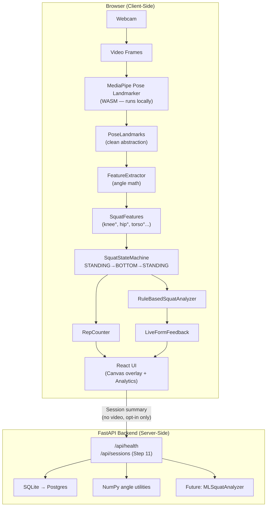

# MotionLab — Architecture

## System Architecture



## Module Responsibilities

### Frontend Modules

| Module | File | Responsibility |
|---|---|---|
| Pose Detector | `services/poseDetector.ts` | MediaPipe initialization + frame inference + landmark abstraction |
| Feature Extractor | `services/featureExtractor.ts` | Landmark → angle/symmetry calculations |
| State Machine | `services/squatStateMachine.ts` | Phase detection with temporal smoothing |
| Rep Counter | `services/repCounter.ts` | Valid cycle detection → rep increment |
| Form Analyzer | `services/formAnalyzer.ts` | Rule-based form checks |
| Session Recorder | `services/sessionRecorder.ts` | Optional opt-in landmark data saver |
| API Client | `services/apiClient.ts` | Backend REST communication |
| Session Store | `store/sessionStore.ts` | Zustand global state |

### Backend Modules

| Module | File | Responsibility |
|---|---|---|
| Main | `app/main.py` | FastAPI app + CORS + router registration |
| Health | `app/api/health.py` | Liveness check |
| Sessions | `app/api/sessions.py` | Session CRUD (Step 11) |
| Angles | `app/analysis/angles.py` | Reusable geometric math (Python mirror of TS) |
| Database | `app/database.py` | SQLAlchemy engine + session factory |

## Data Flow

```
Frame N (33ms interval @ 30fps)
    ↓
MediaPipe detects 33 landmarks (normalized x,y,z + visibility)
    ↓
poseDetector.ts: converts → PoseLandmarks named dictionary
    ↓
featureExtractor.ts: computes:
  - leftKneeAngle  = calculate_angle(leftHip, leftKnee, leftAnkle)
  - rightKneeAngle = calculate_angle(rightHip, rightKnee, rightAnkle)
  - kneeAngle      = mean(leftKneeAngle, rightKneeAngle)
  - torsoAngle     = calculate_torso_angle(shoulderMid, hipMid)
  - kneeAlignment  = kneeX - ankleX (lateral deviation)
  ↓
squatStateMachine.ts:
  if kneeAngle > 160° → STANDING
  if kneeAngle decreasing < 160° → DESCENDING
  if kneeAngle < 100° → BOTTOM
  if kneeAngle increasing < 160° → ASCENDING
  if returns to STANDING → rep complete
    ↓
repCounter.ts: ++repCount, save RepRecord
    ↓
formAnalyzer.ts (per rep):
  - depth:     min kneeAngle > 100° → ⚠ "Go deeper"
  - alignment: kneeX deviation > threshold → ⚠ "Watch knee alignment"
  - torso:     torsoAngle > 45° → ⚠ "Keep torso upright"
    ↓
sessionStore.ts: Zustand state update
    ↓
React re-render (selective — only subscribed components update)
    ↓
Canvas: skeleton redrawn with new landmarks
Analytics panel: new metrics displayed
Feedback banner: updated coaching cue
```

## Squat State Machine Detail

```
        knee° > 160
   ┌──── STANDING ────┐
   │                  │
   │ angle decreasing │ angle returns
   ↓                  │ to STANDING
DESCENDING            │ → REP COUNTED
   │                  │
   │ angle < 100°     │
   ↓                  │
  BOTTOM              │
   │                  │
   │ angle increasing │
   ↓                  │
ASCENDING ────────────┘
```

Temporal smoothing: state only transitions after `CONFIRMATION_FRAMES` (default: 3) consecutive frames agree. This prevents jitter from triggering false state changes.

## Future ML Extension

```
Current (MVP):
  SquatFeatures → RuleBasedSquatAnalyzer → FormFeedback

Future (Phase 2):
  SquatFeatures[] (T frames) → FeatureSequence → MLSquatAnalyzer → FormFeedback
                                                      ↑
                                              (LSTM/CNN trained on
                                               collected landmark sequences)
```

The `MovementAnalyzer` TypeScript interface ensures zero UI changes when switching.

## Technology Decisions

### MediaPipe over OpenCV
- MediaPipe runs in the browser via WASM — no server GPU required
- OpenCV requires Python backend, adding network latency per frame
- MediaPipe Pose Landmarker achieves 30+ FPS in Chrome on modern hardware

### SQLite → Postgres
- SQLite requires zero setup for local development
- SQLAlchemy abstracts the dialect — changing `DATABASE_URL` to Postgres requires no code changes
- Postgres used in production for concurrent session writes

### Zustand over Redux
- Zustand has minimal boilerplate for a single-page tool
- Selective subscriptions prevent full re-renders on every frame update
- Redux overhead not justified for this application size
